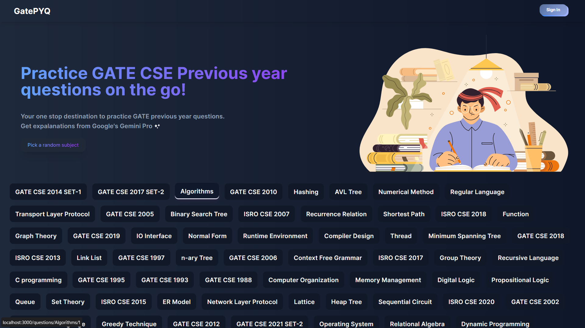
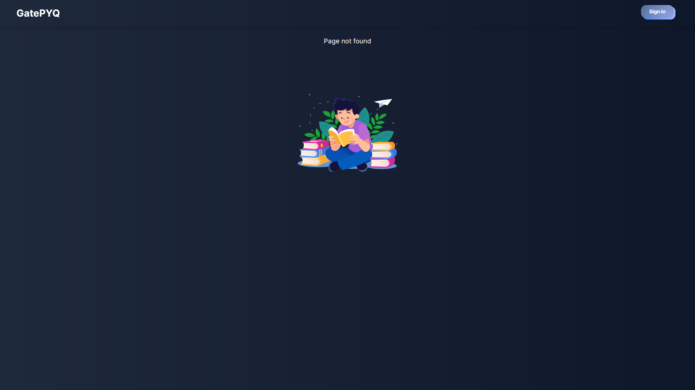

# GatePYQ 📚💻  

[Live Link](https://gate-pyq-web.vercel.app)  

GatePYQ is a dynamic web application designed to help in preparing for competitive exam Graduate Aptitude Test in Engineering (GATE). It provides a centralized platform for accessing and practicing previous year questions.

## Features 🚀

- 📝 Access to extensive collections of previous year questions for GATE exams.
- 📚 Detailed explanations provided for each question and its correct answer, powered by Google's Gemini Pro Generative AI.
- 🔒 Secure authentication using NextAuth with Google and Credentials Providers.
- 🌐 Built with Next.js 14, MongoDB, Prisma, and React components for a seamless user experience.
- 💪 Written in Typescript.
- 〽️ MongoDB data api as an alternative data source. 

## Screenshots 📸

&nbsp;&nbsp;
&nbsp;&nbsp;
&nbsp;&nbsp;
&nbsp;&nbsp;
&nbsp;&nbsp;

## Installation 🛠️

To run GatePYQ locally, follow these steps:

1. Clone the repository:
   ```
   git clone https://github.com/anujd64/GatePYQ.git
   ```

2. Navigate to the project directory:
   ```
   cd GatePYQ
   ```

3. Install dependencies:
   ```
   npm install
   ```

4. Start the development server:
   ```
   npm run dev
   ```

5. Access GatePYQ in your browser at `http://localhost:3000`.